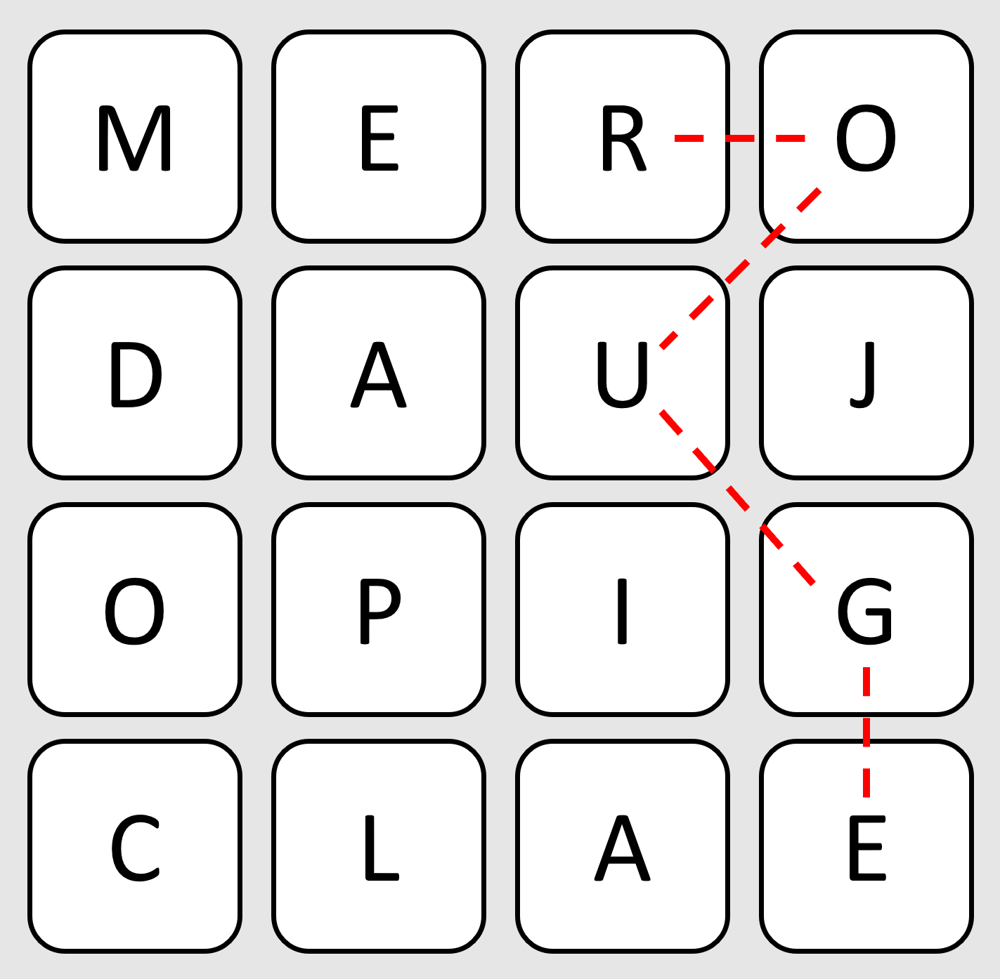
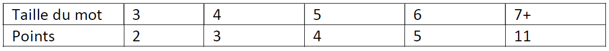

# Mots-caches

*Word Search Game*

**Date de réalisation :** Janvier 2019

**Cadre du projet :** Cours "Programmation Orientée Objet" en 2ème année de prépa intégrée à l'ESILV

**Langage utilisé :** C#

## Présentation du projet

Il s’agit d’un jeu de plateau type mot cachés, qui se joue à 2 joueurs, durant un temps limité de 6 minutes. Le plateau (carré) est constitué de 16 dés à 6 faces. Chaque dé possède une lettre différente sur chacune de ses faces. 
Au début de chaque tour, les dés sont lancés et seule leur face supérieure est visible. Ensuite, le joueur actuel doit saisir les mots qu’il trouve sur le plateau, qui sont formés à partir de lettres adjacentes (horizontalement, verticalement ou en diagonale). 

Par exemple, sur le plateau suivant, le mot ROUGE pourrait être saisi :

<p align="center">
  
</p>

A chaque saisie, le programme vérifie que le mot est bien valide (appartient à notre dictionnaire de mots), n’a pas déjà été proposé, et qu’il contient au moins 3 lettres. Tant que le temps n’est pas écoulé (1 minute par tour), le joueur peut continuer à proposer des mots. En fonction de la taille du mot, les points suivants sont octroyés : 

<p align="center">
  
</p>

La partie est terminée au bout de 6 tours (6 minutes). Le joueur ayant accumulé le plus de points remporte la partie.


## Structure des fichiers

Ce programme contient 6 classes : Dé, Dictionnaire, Joueur, Plateau, TableauDés et Program (qui modélise le jeu).

Deux fichiers supplémentaires sont nécessaires au fonctionnement du programme (à placer dans ./bin/Debug) :

- Des.txt qui recense les lettres présentes sur chacune des faces de nos 16 dés

- MotsPossibles.txt qui est notre dictionnaire pour ce jeu.

Si le projet Visual Studio se nomme Mots_caches, il suit donc cette structure :

```dir
│___Mots_caches
│       bin
│          Debug
│             Des.txt
│             MotsPossibles.txt
│          Release
│       obj
│       Properties
│       App.config
│       Dé.cs
│       Dictionnaire.cs
│       Joueur.cs
│       Plateau.cs
│       Program.cs
│       TableauDés.cs
│       Mots_caches.csproj
│
└───Mots_caches.sln
```
